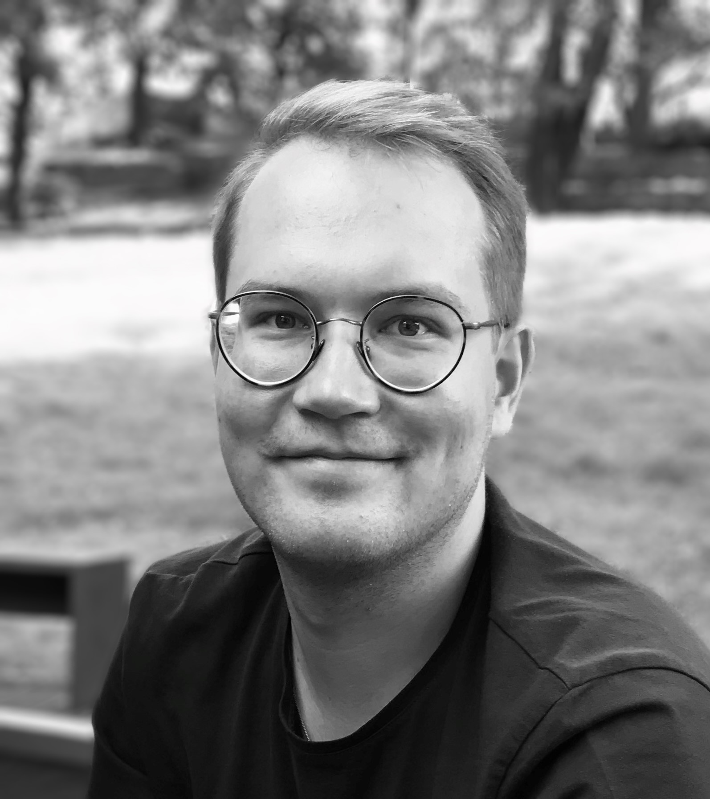

## Introduction

 I am an MA student in Phonetics and Language Technology with a background in Linguistics and Language Didactics. During the past 5 years as an English and French teacher, I have gained acquired valuable skills in planning, scheduling, evaluation and presentation. I have been described as a social, hard-working and development-oriented coworker that quickly adapts into a new team and workplace.

My cross-disciplinary backgound also includes an MA degree in Political Science with professional experience in the Learning and Development section of an international organisation.

## Find me on

[LinkedIn](https://www.linkedin.com/in/joonarajala/)

[GitHub](https://github.com/jxrajala)

## Contact

My email address is of the form first_name.last_name@helsinki.fi. 

## Programming and Language Technology courses taken

[Introduction to Java Programming](https://java-programming.mooc.fi/), summer 2020

[Advanced Course in Java Programming](https://java-programming.mooc.fi/), summer 2020

[Introduction to Databases with SQL](https://studies.helsinki.fi/courses/cu/hy-CU-118023990-2021-08-01), autumn 2020

[Introduction to Python Programming](https://studies.helsinki.fi/courses/cu/hy-CU-118023867-2021-08-01), spring 2021

[Advanced Course in Python Programming](https://studies.helsinki.fi/courses/cu/hy-CU-118023947-2021-08-01), spring 2021

[Introduction to Language Technology](https://studies.helsinki.fi/courses/cu/hy-CU-118591924-2021-08-01), autumn 2021

[Command Line Tools for Linguists](https://studies.helsinki.fi/courses/cu/hy-CU-134651633-2021-08-01), autumn 2021

[Programming for Linguists](https://studies.helsinki.fi/courses/cu/hy-CU-117878680-2021-08-01), autumn 2021

## Projects

Github Personal Website: building a personal homepage on Github using Jekyll Pages as part of Command Line Tools for Linguist course.

## Misc

My personal interests include architecture, urban development and urban travel.
